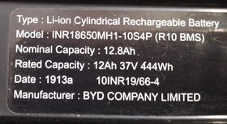

JUMP Battery Management System Specs
======

This repo is a collection of notes and tools made while reversing operation of the BMS in JUMP battery packs.

Thanks to Jehu and Alex for documenting their work on waking up these batteries:

- https://github.com/alex3dbros/LGH1ScooterPackPower  
  Video detailing the hookup of micro-controller to can bus enabling battery pack.
- https://www.youtube.com/watch?v=E87EcLeqIX0  
  Source code for STM32 that enables battery output.

## About the Battery

- Manufactured by BYD. Model INR18650MH1-10S4P (R10 BMS)

  


The BMS speaks the CANopen protocol which makes it easy to fetch all data and interact with the device. At minimum read these two links if not familiar with CAN bus:
  
  - https://en.wikipedia.org/wiki/CAN_bus
  - https://en.wikipedia.org/wiki/CANopen  


- CAN bus baud rate: 100000
- CANopen device profile is unknown and likely vendor specific. The Energybus / Cia-454 profile for light electric vehicles is worthy of investigation but its not publicly available...can-OPEN ?
- CANopen node id is 0x30 and no obvious way to change it. Methods such as LSS do not work. Hopefully there is a method via software or hardware. Worst case is a static ID which means only a single battery per bus.
- BMS starts up with 1 sec heartbeat in pre-operational mode.
- 2 pre-mapped TPDOs available. Mapping is fixed.

- Check Alex's repo for BMS connector [pinout](https://github.com/alex3dbros/LGH1ScooterPackPower/blob/master/JUMP%20Battery%20CON.png)
  
  Pin | Function
  --- | --------
  1 - BLUE | 
  2 - WHITE | 3.3v
  3 - RED | 5v
  4 - YELLOW | CAN HI
  5 - GREEN | CAN LO
  6 - BLACK | GND
  7 - ORANGE | Power enable, connect to 8
  8 - PINK | Power enable, connect to 7

- Power/charge connector Molex ML-XT 4 pin ( should be compatible with Deutsch DT connectors )

- Data connector:  JST JWPF 8 pin

## Whats been discovered so far ?

The main document spec document is available in HTML, Markdown, and YAML below.

The most interesting stuff is located at canopen index 0x2000 and higher.

- Power output enable/disable
- Battery Voltage
- Battery Temperature
- Current in mA
- Capacity in mAh
- Max Capacity in mAh
- State of Charge in %
- How to pull data from BMS or config BMS to push data.

File | Description 
---- | -----------
[jump_bms_spec.yaml](spec/jump_bms_spec.yaml) | Source document for all generated files. You want to edit this if you make any discoveries or changes.
[jump_bms_spec.html](http://htmlpreview.github.io/?https://github.com/jonans/jump_bms/blob/master/spec/jump_bms_spec.html) | HTML version document of the data
[jump_bms_spec.md](spec/jump_bms_spec.md) | Markdown version of the data
[jump_bms.eds](spec/jump_bms.eds) | EDS (cia 306) is the standard file format for describing CANopen devices. Its used by developers to get human readable variable names and automatically generate code. Its incomplete and non compliant but its just enough to work with the Python canopen library.

## Whats else is needed ? 

1. A way to change the device ID so more than one battery can be controlled on the same bus.
1. Balance information such as per cell voltage or deltas if any.
1. Cycle count/history if any.
1. Calibration procedure if not automatic.
1. LVC info if any.
1. High resolution photos of the BMS and its components for repair/debugging. Already killed one caused by short on 8 pin connector. DC-DC stage is dead.

## Tools

Tools were created with Python under linux. Should run on windows but hasn't been tested and may need fixing.

Tool | Description
---- | -----
tools/canopendump | Simple tool that dumps all device data to text or csv
tools/bmsmonitor | Sample code that displays BMS status such as power state, voltage, temperature, current, capacity, and state of charge. Demonstrates configuring BMS to automatically push data at intervals.
tools/canspec | Takes the spec file jump_bms_spec.yaml and generates html, markdown, and eds files.

### Setup environment

**Minimum Requirements**

- Python 3.2 or later
- pipenv

 Run the following inside the jump_bms directory to automatically install the rest and setup shell to run the tools.

```shell
pipenv install
pipenv shell
```

Setup your can interface:

```
ip link set can0 type can bitrate 100000
ip link set can0 txqueuelen 1000 up
```

## What can you do ?

- Analyze the test scenarios and see what you can decode.
- Get yourself a USB to CAN interface so you can poke around and run your own tests. Anything supported by the python-can library should work:
  
  https://python-can.readthedocs.io/en/master/interfaces.html

- Add anything you discover to the spec file jump_bms_spec.yaml and submit a pull request.

## Test Scenarios

Reversing the device is mostly about decoding the meaning of each data point on the BMS.

We can dump all the data and compare the differences under various testing conditions to facilitate this:

### Testing for temperature

- Battery placed in freezer for about 2 hours and then removed.
- Output off, no load, 34.3v

1. [cold-1.csv](tests/cold-1.csv) - 5 min after,  room temp 24c
1. [cold-2.csv](tests/cold-2.csv) - 30 min after, room temp 24c
1. [cold-3.csv](tests/cold-3.csv) - 45 min after, room temp 23c
1. [cold-4.csv](tests/cold-4.csv) - 60 min after, room temp 23c

### Testing no load state with power off / on

- Dump BMS at idle with power on then off

1. [idle-power-off.csv](test/idle-power-off.csv) - Power off
1. [idle-power-on.csv](test/idle-power-on.csv) - Power on

### Charging

- Charge battery under different conditions

1. [charge-2A.csv](test/charge-2A.csv) - Charging @ 2A 36v
1. [charge-5A-40v.csv](test/charge-5A-40v.csv) - Charging @ 5A 40v

